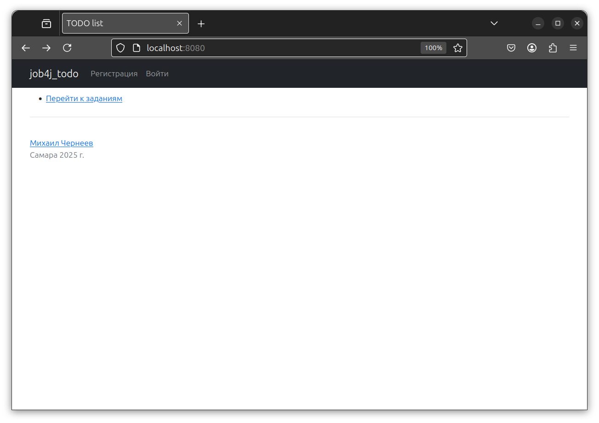
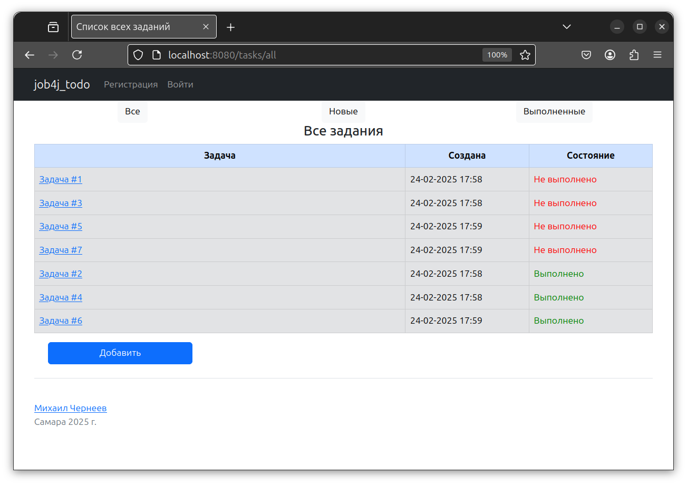
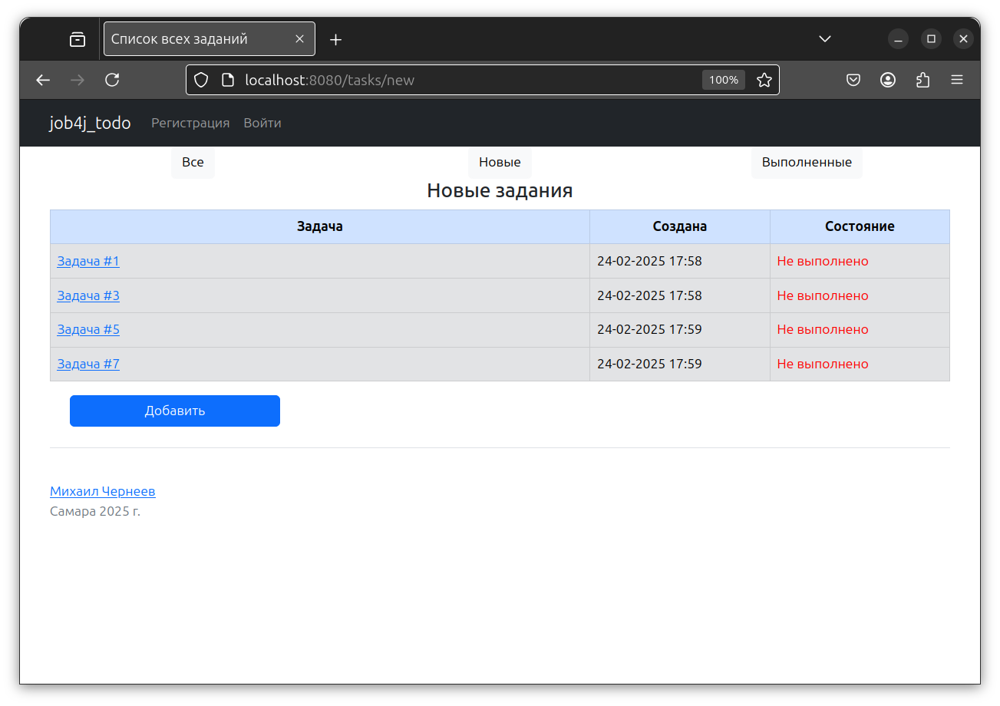

## Проект "TODO список".

### Описание задачи:
Цель проекта - разработка веб-приложения мониторинга текущих задач пользователя.

Основной функционал включает:
+ Создание задания;
+ Основные CRUD операции с сущностью "задание";
+ На странице со списком задач присутствует три ссылки: "Все", "Выполненные", "Новые" для отображения только требуемых заданий;
+ При переходе по ссылкам в списке задач переходим на страницу с подробным описанием задания;

### Используемые технологии:
+ Java
+ Spring Boot
+ Thymeleaf
+ Bootstrap
+ Hibernate
+ PostgreSQL

### Окружение:
+ Java 17
+ Maven
+ PostgreSQL

### Запуск приложения

1. Создайте базу данных PostgreSQL
``` sql
CREATE USER todo WITH PASSWORD 'todo';
CREATE DATABASE todo
GRANT ALL PRIVILEGES ON DATABASE todo to todo;
```

2. Клонируйте репозиторий
``` bash
cd job4j_todo
git clone https://github.com/MikhailChrn/job4j_todo
```

3. Соберите проект с помощью Maven:
``` bash
mvn clean install 
```

4. Запустите приложение:
``` bash
mvn spring-boot:run
```
5. После запуска:
Проект доступен по адресу: [http://localhost:8080](http://localhost:8080)

### Взаимодействие с приложением

1. Приветствие



2. Главная



3. Результат применения фильтра "Новые" 



4. Страница редактирования задачи


### Контакты

mikhail.cherneyev@yandex.ru
